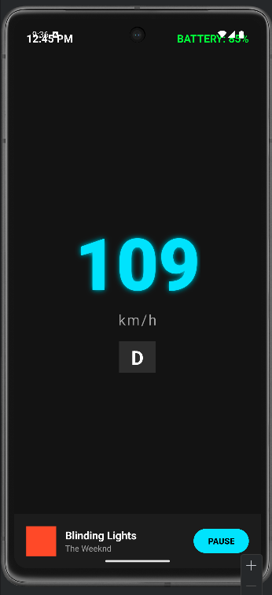

# 🚘 Android Automotive HMI Dashboard Prototype

## 📌 Project Overview
A native **Android Infotainment Cluster** prototype developed with Java. This project simulates a modern digital car dashboard, focusing on **HMI (Human-Machine Interface)** design principles used in the automotive industry.

## 🛠️ Technologies Used
* **Platform:** Android (Native)
* **Language:** Java
* **IDE:** Android Studio
* **Design:** XML Layouts (Relative & Linear Layouts)

## 🚀 Key Features
* **Dynamic Speedometer:** Simulates real-time acceleration and deceleration using Java threads.
* **Digital Cluster UI:** Features a neon-themed dark mode interface optimized for driver readability.
* **System Indicators:** Displays real-time clock, battery status (SoC), and gear selection.
* **Media Control:** Interactive music player widget simulation.
